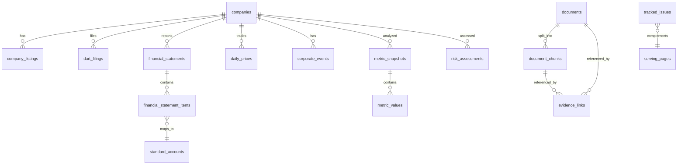

# finDART DB schema draft

## Direction

The API server owns read access to PostgreSQL data and exposes narrow ingest endpoints for a separate pipeline to upload collected rows. External provider calls, scheduling, and retry state remain outside this API server, so runtime collection queue tables are not part of this service schema.

## Entity Relationships



## Core Tables

### `companies`

Company master data. This is the central lookup table for the public API.

Important indexes:

- `idx_companies_market_active (market, is_active)`
- `idx_companies_name (corp_name)`

### `company_listings`

Listing history for companies and stock codes.

Unique key:

- `(company_id, stock_code, market, listed_at)`

### `dart_filings`

DART filing metadata already loaded by the external data pipeline.

Important indexes:

- `idx_dart_filings_company_period (company_id, report_year, report_period)`
- `idx_dart_filings_receipt_date (receipt_date)`

### `financial_statements`

Financial statement headers per company, report period, statement type, and consolidation basis.

Unique key:

- `(company_id, report_year, report_period, statement_type, is_consolidated)`

### `financial_statement_items`

Statement line items mapped to optional standard accounts.

Important indexes:

- `idx_fsi_statement_account (statement_id, account_id)`
- `idx_fsi_dart_account (dart_account_id)`

### `standard_accounts` and `account_aliases`

Canonical account definitions and source-specific account aliases.

Important indexes:

- `idx_account_aliases_lookup (source, raw_account_name, is_active)`
- `idx_account_aliases_dart_id (dart_account_id)`

### `daily_prices`

Daily OHLCV and market data already loaded by the external data pipeline.

Unique key:

- `(company_id, trade_date)`

### `corporate_events`

Normalized company events such as management issues, audit opinions, and trading suspensions.

Important indexes:

- `idx_corporate_events_company_date (company_id, event_date)`
- `idx_corporate_events_type_date (event_type, event_date)`
- `uq_corporate_events_source_id (source, source_id)`
- `uq_corporate_events_fallback (company_id, event_type, event_subtype, event_date, source)`

### Metrics and Risk

`metric_definitions`, `metric_snapshots`, `metric_values`, and `risk_assessments` store calculated analysis outputs for read APIs. Calculation jobs are outside this API server.

### `serving_pages`

Prebuilt UI payloads for frontend serving. The Today screen reads this table as
the primary path and does not join source tables to compose the screen.

Important lookup:

```sql
select page_id, page_type, page_date, market, title, status, payload, generated_at
from serving_pages
where page_type = 'today'
  and page_date = :date
  and market = :market
  and user_id = ''
order by generated_at desc
limit 1;
```

Important index:

- `idx_serving_pages_today_lookup (page_type, page_date, market, user_id, generated_at desc)`

For Today, `payload` is expected to contain:

- `daily_indicators`
- `market_regimes`
- `headlines`
- `issues`
- `tracked_issues`
- `events`

The API also exposes normalized `indicator_values` derived from
`payload.daily_indicators` for interest rates, FX, inflation, and growth. Each
group includes today's value and the previous value when the payload provides
them.

### `tracked_issues`

User-specific issue subscriptions for the Today Issue Tracking panel.

Unique key:

- `(user_id, market, subscription_key)`

### `documents`

Source documents used for evidence drill-down. Today cards contain minimal
evidence references in `serving_pages.payload`; this table provides full source
metadata, summaries, raw text, and publication timestamps when the user opens a
source.

Important index:

- `idx_documents_published_at (published_at)`

### `document_chunks`

Chunk-level evidence text for source documents.

Important index:

- `idx_document_chunks_doc_id (doc_id, chunk_index)`

### `evidence_links`

Optional normalized relation between generated serving pages and evidence
documents/chunks. The Today API does not need this table to render the screen,
but it is available for audit, debug, and future evidence ranking views.

Important index:

- `idx_evidence_links_target (target_type, target_id, section_key, final_rank)`

## Removed Runtime Tables

The server no longer creates or uses:

- `data_collection_jobs`
- `collection_schedules`
