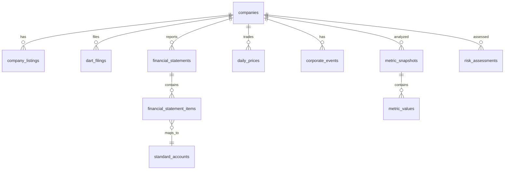

# finDART DB schema draft

## Direction

The API server owns read access to PostgreSQL data and exposes narrow ingest endpoints for a separate pipeline to upload collected rows. External provider calls, scheduling, and retry state remain outside this API server, so runtime collection queue tables are not part of this service schema.

## Entity Relationships

## Core Tables

### `companies`

Company master data. This is the central lookup table for the public API.

Important indexes:

- `idx_companies_market_active (market, is_active)`
- `idx_companies_name (corp_name)`

### `company_listings`

Listing history for companies and stock codes.

Unique key:

- `(company_id, stock_code, market, listed_at)`

### `dart_filings`

DART filing metadata already loaded by the external data pipeline.

Important indexes:

- `idx_dart_filings_company_period (company_id, report_year, report_period)`
- `idx_dart_filings_receipt_date (receipt_date)`

### `financial_statements`

Financial statement headers per company, report period, statement type, and consolidation basis.

Unique key:

- `(company_id, report_year, report_period, statement_type, is_consolidated)`

### `financial_statement_items`

Statement line items mapped to optional standard accounts.

Important indexes:

- `idx_fsi_statement_account (statement_id, account_id)`
- `idx_fsi_dart_account (dart_account_id)`

### `standard_accounts` and `account_aliases`

Canonical account definitions and source-specific account aliases.

Important indexes:

- `idx_account_aliases_lookup (source, raw_account_name, is_active)`
- `idx_account_aliases_dart_id (dart_account_id)`

### `daily_prices`

Daily OHLCV and market data already loaded by the external data pipeline.

Unique key:

- `(company_id, trade_date)`

### `corporate_events`

Normalized company events such as management issues, audit opinions, and trading suspensions.

Important indexes:

- `idx_corporate_events_company_date (company_id, event_date)`
- `idx_corporate_events_type_date (event_type, event_date)`
- `uq_corporate_events_source_id (source, source_id)`
- `uq_corporate_events_fallback (company_id, event_type, event_subtype, event_date, source)`

### Metrics and Risk

`metric_definitions`, `metric_snapshots`, `metric_values`, and `risk_assessments` store calculated analysis outputs for read APIs. Calculation jobs are outside this API server.

## Removed Runtime Tables

The server no longer creates or uses:

- `data_collection_jobs`
- `collection_schedules`
