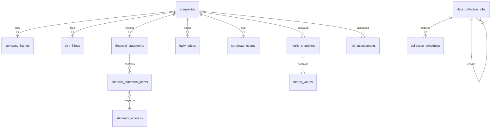

# finDART DB schema draft

## 방향

- 대상 시장은 우선 KOSPI 상장사로 한정한다.
- 원천 데이터와 산출 지표를 분리한다.
- 재무제표는 DART 기준 계정 코드와 표준화 계정 매핑을 함께 보관한다.
- 주가 지표는 FinanceDataReader 일별 OHLCV에서 산출한다.
- 신용/부실/품질 지표는 회사-기간 단위 스냅샷으로 저장한다.
- 이벤트성 데이터는 별도 테이블에 쌓고, 분석 스냅샷에서 참조 가능하게 한다.

권장 DB는 PostgreSQL이다. FastAPI에서는 SQLAlchemy 2.x + Alembic 조합을 기본으로 둔다.

## 핵심 엔티티

## 테이블

### companies

기업 마스터. DART, KRX, FinanceDataReader의 식별자를 연결하는 중심 테이블.

| 컬럼 | 타입 | 설명 |
| --- | --- | --- |
| id | bigserial PK | 내부 기업 ID |
| corp_code | varchar(8) unique | DART 고유번호 |
| stock_code | varchar(6) unique | 종목코드 |
| corp_name | varchar(200) | 회사명 |
| corp_name_eng | varchar(200) nullable | 영문명 |
| market | varchar(20) | KOSPI, KOSDAQ 등. 우선 KOSPI |
| sector | varchar(100) nullable | 업종 |
| industry | varchar(100) nullable | 세부 산업 |
| fiscal_month | smallint nullable | 결산월 |
| listed_at | date nullable | 상장일 |
| delisted_at | date nullable | 상장폐지일 |
| is_active | boolean | 현재 분석 대상 여부 |
| created_at | timestamptz | 생성시각 |
| updated_at | timestamptz | 수정시각 |

인덱스:

- `idx_companies_market_active (market, is_active)`
- `idx_companies_name (corp_name)`

### company_listings

상장 정보 이력. 이전/변경 시장, 종목명 변경, 상장폐지 이력을 담는다.

| 컬럼 | 타입 | 설명 |
| --- | --- | --- |
| id | bigserial PK | 내부 ID |
| company_id | bigint FK | 기업 ID |
| stock_code | varchar(6) | 종목코드 |
| stock_name | varchar(200) | 종목명 |
| market | varchar(20) | 시장 |
| listed_at | date nullable | 시작일 |
| ended_at | date nullable | 종료일 |
| listing_status | varchar(30) | LISTED, DELISTED, SUSPENDED 등 |
| source | varchar(50) | FDR, KRX 등 |

유니크:

- `(company_id, stock_code, market, listed_at)`

### dart_filings

DART 공시 메타데이터. 재무제표 수집 근거와 감사의견/관리종목 이벤트 연결에 사용한다.

| 컬럼 | 타입 | 설명 |
| --- | --- | --- |
| id | bigserial PK | 내부 ID |
| company_id | bigint FK | 기업 ID |
| rcept_no | varchar(20) unique | DART 접수번호 |
| report_code | varchar(10) | 사업보고서/분기보고서 코드 |
| report_name | varchar(300) | 보고서명 |
| report_year | smallint | 보고 연도 |
| report_period | varchar(10) | FY, Q1, Q2, Q3 |
| receipt_date | date | 접수일 |
| filing_date | date nullable | 공시일 |
| is_consolidated | boolean nullable | 연결 여부 |
| source_url | text nullable | 원문 URL |
| raw_payload | jsonb nullable | 원천 응답 |
| created_at | timestamptz | 생성시각 |

인덱스:

- `idx_dart_filings_company_period (company_id, report_year, report_period)`
- `idx_dart_filings_receipt_date (receipt_date)`

### financial_statements

회사-기간-재무제표 종류 단위의 헤더.

| 컬럼 | 타입 | 설명 |
| --- | --- | --- |
| id | bigserial PK | 내부 ID |
| company_id | bigint FK | 기업 ID |
| filing_id | bigint FK nullable | DART 공시 ID |
| report_year | smallint | 보고 연도 |
| report_period | varchar(10) | FY, Q1, Q2, Q3 |
| statement_type | varchar(20) | BS, IS, CIS, CF |
| currency | varchar(10) | KRW 등 |
| unit | bigint | 원천 단위. 예: 1, 1000, 1000000 |
| is_consolidated | boolean | 연결 여부 |
| accounting_standard | varchar(20) nullable | IFRS, GAAP 등 |
| period_start | date nullable | 회계기간 시작 |
| period_end | date | 회계기간 종료 |
| created_at | timestamptz | 생성시각 |

유니크:

- `(company_id, report_year, report_period, statement_type, is_consolidated)`

### financial_statement_items

DART에서 받은 계정 항목 원천값과 표준 계정 매핑.

| 컬럼 | 타입 | 설명 |
| --- | --- | --- |
| id | bigserial PK | 내부 ID |
| statement_id | bigint FK | 재무제표 헤더 ID |
| account_id | bigint FK nullable | 표준 계정 ID |
| dart_account_id | varchar(100) nullable | DART account_id |
| account_name | varchar(300) | 원천 계정명 |
| account_detail | varchar(300) nullable | 세부 계정명 |
| amount | numeric(24, 4) nullable | 현재 기간 금액 |
| amount_previous | numeric(24, 4) nullable | 전기 금액 |
| amount_before_previous | numeric(24, 4) nullable | 전전기 금액 |
| ordinal | integer nullable | 표시 순서 |
| raw_payload | jsonb nullable | 원천 행 |

인덱스:

- `idx_fsi_statement_account (statement_id, account_id)`
- `idx_fsi_dart_account (dart_account_id)`

### standard_accounts

지표 계산에 필요한 계정 표준화 테이블. 한국어 계정명 변화와 DART account_id 변동을 흡수한다.

| 컬럼 | 타입 | 설명 |
| --- | --- | --- |
| id | bigserial PK | 내부 ID |
| code | varchar(80) unique | 표준 계정 코드 |
| name_ko | varchar(200) | 표준 계정명 |
| statement_type | varchar(20) | BS, IS, CIS, CF |
| normal_sign | smallint | 정상 부호. 1 또는 -1 |
| description | text nullable | 설명 |

초기 표준 계정 후보:

- `total_assets`
- `current_assets`
- `total_liabilities`
- `current_liabilities`
- `retained_earnings`
- `working_capital`
- `sales`
- `gross_profit`
- `operating_income`
- `ebit`
- `ebitda`
- `net_income`
- `income_before_tax`
- `interest_expense`
- `operating_cash_flow`
- `capex`
- `total_debt`
- `short_term_debt`
- `long_term_debt`
- `cash_and_equivalents`
- `accounts_receivable`
- `inventory`
- `cost_of_sales`
- `sga_expense`
- `depreciation_amortization`
- `shares_outstanding`

### account_aliases

원천 계정명/계정코드를 표준 계정으로 매핑한다.

| 컬럼 | 타입 | 설명 |
| --- | --- | --- |
| id | bigserial PK | 내부 ID |
| account_id | bigint FK | 표준 계정 ID |
| source | varchar(50) | DART 등 |
| dart_account_id | varchar(100) nullable | DART 계정 ID |
| raw_account_name | varchar(300) | 원천 계정명 |
| match_rule | varchar(30) | EXACT, CONTAINS, REGEX |
| priority | integer | 매핑 우선순위 |
| is_active | boolean | 사용 여부 |

인덱스:

- `idx_account_aliases_lookup (source, raw_account_name, is_active)`
- `idx_account_aliases_dart_id (dart_account_id)`

### daily_prices

FinanceDataReader 기반 일별 가격.

| 컬럼 | 타입 | 설명 |
| --- | --- | --- |
| id | bigserial PK | 내부 ID |
| company_id | bigint FK | 기업 ID |
| trade_date | date | 거래일 |
| open | numeric(18, 4) nullable | 시가 |
| high | numeric(18, 4) nullable | 고가 |
| low | numeric(18, 4) nullable | 저가 |
| close | numeric(18, 4) | 종가 |
| adjusted_close | numeric(18, 4) nullable | 수정종가 |
| volume | bigint nullable | 거래량 |
| change_rate | numeric(12, 8) nullable | 일간 수익률 |
| market_cap | numeric(24, 4) nullable | 시가총액 |
| shares_outstanding | numeric(24, 4) nullable | 상장주식수 |
| source | varchar(50) | FDR 등 |

유니크:

- `(company_id, trade_date)`

인덱스:

- `idx_daily_prices_date (trade_date)`

### corporate_events

관리종목, 감사의견, 거래정지 등 이벤트. KRX/DART 수집 경로가 달라도 한 테이블에 표준화한다.

| 컬럼 | 타입 | 설명 |
| --- | --- | --- |
| id | bigserial PK | 내부 ID |
| company_id | bigint FK | 기업 ID |
| event_type | varchar(50) | MANAGEMENT_ISSUE, AUDIT_OPINION, TRADING_SUSPENSION 등 |
| event_subtype | varchar(100) nullable | 한정, 부적정, 의견거절 등 |
| event_date | date | 발생/공시일 |
| start_date | date nullable | 시작일 |
| end_date | date nullable | 종료일 |
| severity | smallint nullable | 1 낮음 - 5 높음 |
| title | varchar(300) | 이벤트 제목 |
| description | text nullable | 상세 |
| source | varchar(50) | DART, KRX 등 |
| source_id | varchar(100) nullable | 접수번호 등 |
| source_url | text nullable | 원문 URL |
| raw_payload | jsonb nullable | 원천 응답 |
| created_at | timestamptz | 생성시각 |

인덱스:

- `idx_corporate_events_company_date (company_id, event_date)`
- `idx_corporate_events_type_date (event_type, event_date)`
- `uq_corporate_events_source_id (source, source_id) where source_id is not null`
- `uq_corporate_events_fallback (company_id, event_type, event_subtype, event_date, source) where source_id is null`

### metric_definitions

지표 메타데이터. 계산 로직 버전과 방향성을 관리한다.

| 컬럼 | 타입 | 설명 |
| --- | --- | --- |
| id | bigserial PK | 내부 ID |
| code | varchar(80) unique | 지표 코드 |
| name | varchar(200) | 지표명 |
| category | varchar(50) | bankruptcy, quality, leverage, market, event |
| higher_is_better | boolean nullable | 높을수록 좋은지 |
| formula_version | varchar(30) | 계산식 버전 |
| description | text nullable | 설명 |
| is_active | boolean | 사용 여부 |

초기 지표:

- `altman_z_score`
- `ohlson_o_score`
- `zmijewski_x_score`
- `piotroski_f_score`
- `beneish_m_score`
- `interest_coverage_ratio`
- `net_debt_to_ebitda`
- `operating_cash_flow_to_total_liabilities`
- `max_drawdown`
- `price_volatility`
- `event_risk_score`

### metric_snapshots

분석 기준일 스냅샷. 같은 회사/기간이라도 계산식 버전, 데이터 갱신에 따라 재산출 가능하게 한다.

| 컬럼 | 타입 | 설명 |
| --- | --- | --- |
| id | bigserial PK | 내부 ID |
| company_id | bigint FK | 기업 ID |
| as_of_date | date | 분석 기준일 |
| report_year | smallint nullable | 기반 재무제표 연도 |
| report_period | varchar(10) nullable | FY, Q1, Q2, Q3 |
| price_window_days | integer nullable | 주가 지표 산출 기간 |
| statement_basis | varchar(20) | CONSOLIDATED, SEPARATE |
| data_quality_score | numeric(8, 4) nullable | 데이터 품질 점수 |
| calculation_status | varchar(30) | SUCCESS, PARTIAL, FAILED |
| error_message | text nullable | 실패 사유 |
| created_at | timestamptz | 생성시각 |

유니크:

- `(company_id, as_of_date, report_year, report_period, statement_basis, price_window_days)`

인덱스:

- `idx_metric_snapshots_asof (as_of_date)`

### metric_values

스냅샷별 산출 지표 값.

| 컬럼 | 타입 | 설명 |
| --- | --- | --- |
| id | bigserial PK | 내부 ID |
| snapshot_id | bigint FK | 스냅샷 ID |
| metric_id | bigint FK | 지표 정의 ID |
| value | numeric(24, 8) nullable | 산출값 |
| raw_components | jsonb nullable | 계산에 사용한 중간값 |
| interpretation | varchar(50) nullable | GOOD, WATCH, DISTRESS 등 |
| confidence | numeric(8, 4) nullable | 계산 신뢰도 |
| note | text nullable | 결측/보정 설명 |

유니크:

- `(snapshot_id, metric_id)`

### risk_assessments

여러 지표를 종합한 최종 평가 결과. 모델/룰셋 변경을 버전으로 남긴다.

| 컬럼 | 타입 | 설명 |
| --- | --- | --- |
| id | bigserial PK | 내부 ID |
| company_id | bigint FK | 기업 ID |
| snapshot_id | bigint FK | 지표 스냅샷 ID |
| model_version | varchar(30) | 평가 모델 버전 |
| credit_grade | varchar(20) nullable | 내부 등급. 예: A, BBB, Watch |
| risk_score | numeric(8, 4) | 0-100 등 |
| risk_level | varchar(30) | LOW, MEDIUM, HIGH, DISTRESS |
| summary | text nullable | 평가 요약 |
| strengths | jsonb nullable | 긍정 요인 |
| weaknesses | jsonb nullable | 위험 요인 |
| created_at | timestamptz | 생성시각 |

유니크:

- `(snapshot_id, model_version)`

### data_collection_jobs

수집/계산 작업 큐. API 서버는 이 테이블에 job을 생성하고 즉시 반환한다. 외부 데이터 fetch는 별도 worker가 `QUEUED` job을 가져가 처리한다.

| 컬럼 | 타입 | 설명 |
| --- | --- | --- |
| id | bigserial PK | 내부 ID |
| job_id | varchar(40) unique | 외부 노출용 job ID |
| job_type | varchar(50) | COLLECT_COMPANIES, COLLECT_FINANCIALS, RECALCULATE_METRICS 등 |
| status | varchar(30) | QUEUED, RUNNING, SUCCESS, PARTIAL_SUCCESS, FAILED, CANCELED |
| requested_by | varchar(100) nullable | 요청자/API key/user ID |
| market | varchar(20) | 기본 KOSPI |
| params | jsonb | 요청 파라미터 |
| progress | jsonb | total, processed, succeeded, failed, failed_items 등 |
| error | jsonb nullable | 실패 코드/메시지/상세 |
| parent_job_id | bigint FK nullable | 후속 job을 만든 부모 job |
| enqueue_recalculation | boolean | 수집 성공 후 지표/위험도 재계산 job 생성 여부 |
| created_at | timestamptz | 생성시각 |
| queued_at | timestamptz | 큐 진입시각 |
| started_at | timestamptz nullable | 시작시각 |
| finished_at | timestamptz nullable | 종료시각 |

인덱스:

- `idx_data_collection_jobs_status_created (status, created_at)`
- `idx_data_collection_jobs_type_created (job_type, created_at)`
- `idx_data_collection_jobs_parent (parent_job_id)`

### collection_schedules

데이터 종류별 권장 수집 주기와 마지막 성공/다음 권장 실행 시각. MVP에서는 자동 실행하지 않고 수동 trigger 화면/API의 freshness 판단에 사용한다.

| 컬럼 | 타입 | 설명 |
| --- | --- | --- |
| id | bigserial PK | 내부 ID |
| schedule_code | varchar(80) unique | 스케줄 코드 |
| job_type | varchar(50) | 실행할 job type |
| market | varchar(20) | 기본 KOSPI |
| recommended_interval | varchar(30) | DAILY, WEEKLY, MONTHLY, QUARTERLY |
| is_active | boolean | 사용 여부 |
| params | jsonb | 기본 실행 파라미터 |
| last_success_job_id | bigint FK nullable | 마지막 성공 job |
| last_success_at | timestamptz nullable | 마지막 성공 시각 |
| next_recommended_at | timestamptz nullable | 다음 권장 실행 시각 |
| created_at | timestamptz | 생성시각 |
| updated_at | timestamptz | 수정시각 |

초기 스케줄:

- `kospi_companies_monthly`: KOSPI 상장사 마스터, 월 1회 권장
- `kospi_filings_quarterly`: DART 공시 목록, 분기별 권장
- `kospi_financials_quarterly`: DART 재무제표, 분기별 권장
- `kospi_prices_daily`: 일별 주가, 1일 1회 권장
- `kospi_events_daily`: 관리종목/감사의견/거래정지 이벤트, 1일 1회 권장

## 지표별 데이터 의존성

| 지표 | 주요 원천 | 필요 계정/데이터 |
| --- | --- | --- |
| Altman Z-score | 재무제표, 주가 | 운전자본, 총자산, 이익잉여금, EBIT, 시가총액, 총부채, 매출 |
| Ohlson O-score | 재무제표 | 총자산, 총부채, 유동자산, 유동부채, 순이익, 영업현금흐름 |
| Zmijewski X-score | 재무제표 | 순이익, 총자산, 총부채, 유동자산, 유동부채 |
| Piotroski F-score | 재무제표 | ROA, CFO, 부채비율, 유동비율, 증자 여부, 매출총이익률, 자산회전율 |
| Beneish M-score | 재무제표 | 매출채권, 매출, 매출총이익, 유동자산, 유형자산, 감가상각, 판관비, 부채 |
| 이자보상배율 | 재무제표 | EBIT 또는 영업이익, 이자비용 |
| 순차입금/EBITDA | 재무제표 | 총차입금, 현금성자산, EBITDA |
| 영업현금흐름/총부채 | 재무제표 | 영업현금흐름, 총부채 |
| MDD/주가변동성 | 일별 주가 | 종가 또는 수정종가, 산출 기간 |
| 관리종목/감사의견/거래정지 | 이벤트 | KRX/DART 이벤트 |

## 산출 정책 초안

- 조회 API는 OpenDartReader 또는 FinanceDataReader를 직접 호출하지 않고 DB에 저장된 최신 성공 데이터만 읽는다.
- 수집 API는 `data_collection_jobs`에 job을 생성하고 `202 Accepted`로 반환한다.
- 별도 worker가 job을 처리하며, fetch 결과는 원천 테이블에 idempotent upsert한다.
- 수집 job 성공 후 `enqueue_recalculation = true`이면 지표 재계산 job을 자동 생성한다.
- 지표 재계산 job 성공 후 위험도 평가 job을 자동 생성한다.
- 기본 재무제표는 연결 재무제표를 우선 사용한다.
- 연결 재무제표가 없으면 별도 재무제표로 대체하되 `statement_basis`와 `confidence`에 반영한다.
- 연간 지표는 FY 기준으로 산출한다.
- TTM이 필요한 경우 별도 `report_period = TTM` 정책을 추가한다.
- MDD/변동성 기본 윈도우는 252 거래일로 둔다.
- 이벤트 위험은 분석 기준일 이전 1년 이벤트를 기본 반영한다.
- 결측값이 있는 지표는 억지로 0 대체하지 않고 `value = null`, `calculation_status = PARTIAL`로 남긴다.

## DB 적재 정책

| 데이터 | 트리거 | 권장 주기 | 적재 테이블 | 중복 방지 기준 |
| --- | --- | --- | --- | --- |
| 상장사 마스터 | 수동 | 월 1회 | `companies`, `company_listings` | `corp_code`, `stock_code` |
| DART 공시 목록 | 수동 | 분기별 | `dart_filings` | `rcept_no` |
| DART 재무제표 | 수동 | 분기별 | `financial_statements`, `financial_statement_items` | statement 유니크 키, items replace |
| 일별 주가 | 수동 | 1일 1회 | `daily_prices` | `(company_id, trade_date)` |
| 이벤트 | 수동 | 1일 1회 | `corporate_events` | source/source_id 우선, 없으면 회사/타입/일자 |

재무제표 항목은 statement 단위로 기존 items를 삭제하고 새로 삽입한다. 나머지 원천 데이터는 upsert를 기본으로 한다. 일부 기업 fetch 실패 시 성공분은 반영하고, 실패 목록은 job `progress.failed_items`와 `error`에 저장한다.

## 추후 확장 후보

- `source_documents`: 원문 파일/HTML 저장 메타
- `analyst_notes`: 사용자 메모와 수동 보정
- `watchlists`: 관심 기업 묶음
- `peer_groups`: 동종업계 비교군
- `metric_percentiles`: 시장/업종 내 분위수
